<!-- Converted from SE_LGANet_V1.docx. Embedded figures are stored in ../figures/. -->

Type of the Paper (Article, Review, Communication, etc.)

# SE-LGANet: Explainable automated classification of cervical cancer cells using squeeze-and-excitation blocks and local and global attention mechanisms

Ömer Faruk Alçin 1, Firstname Lastname 2,*, Muzaffer Aslan 3, Zafer Cömert 4

| Academic Editor: Firstname Lastname Received: date Revised: date Accepted: date Published: date Copyright: © 2026 by the authors. Submitted for possible open access publication under the terms and conditions of the Creative Commons Attribution (CC BY) license. |
| --- |

1 Department of Software Engineering, Faculty of Engineering, Inonu University, Malatya 44210, Turkiye; omer.alcin@inonu.edu.tr

2 Affiliation 2; e-mail@e-mail.com

3 Department of Electrical and Electronics Engineering, Faculty of Engineering, Bingol University, 12000, Bingol, Turkiye; muzafferaslan@bingol.edu.tr

4 Department of Software Engineering, Samsun University, Samsun, Turkiye; zcomert@samsun.edu.tr

* Correspondence: e-mail@e-mail.com; Tel.: (optional; include country code; if there are multiple corresponding authors, add author initials)

**Highlights**

What are the main findings?

- Synergized SE blocks and dual-scale attention mechanisms within CNNs to enhance feature extraction and cervical cell classification accuracy.

- Incorporated Grad-CAM for visual explanations, enhancing transparency and trust in AI-driven diagnostics.

What are the implications of the main findings?

- Demonstrated high sensitivity and specificity, confirming the model’s robustness in classifying cervical cells accurately.

- It yielded high performance for all publicly available datasets, ensuring high reproducibility and reliability of the model.

**Abstract**

Background/Objectives: Cervical malignancy continues to be a major global health burden for women, necessitating early detection to enhance clinical prognosis and survival rates. Within this framework, Pap Smear screenings represent a pivotal diagnostic approach for identifying precancerous cellular alterations at their onset. This study aims to refine the classification of diverse cervical cell categories using the SIPaKMeD dataset, focusing on improving both diagnostic accuracy and model interpretability. Methods: o maximize the efficiency of feature representation, Squeeze-and-Excitation (SE) blocks were combined with dual attention mechanisms within a Convolutional Neural Network (CNN) framework. The proposed model was designed to classify five distinct cell categories: Koilocytotic, Parabasal, Superficial-Intermediate, Dyskeratotic, and Metaplastic cells. Additionally, Gradient-weighted Class Activation Mapping (Grad-CAM) was integrated as an interpretability layer to clarify the model's inferential logic and visualize lesion areas. The architecture's robustness was further validated using the Mendeley LBC and Herlev benchmark datasets. Results: Empirical outcomes highlighted superior performance, with the proposed system reaching 91.48% accuracy, 91.57% sensitivity, and 97.87% specificity on the SIPaKMeD dataset. Furthermore, the model demonstrated high transferability, achieving 96.88% accuracy on Mendeley LBC and 89.62% accuracy on the Herlev dataset. The Grad-CAM visualizations confirmed that the model focuses on clinically relevant cellular descriptors. Conclusions: These results suggest that the proposed methodology serves as a dependable and robust solution for cervical cell evaluation. The integration of attention mechanisms and interpretability tools bridges the gap between AI performance and clinical trust. Prospective research will aim at integrating this framework into real-world clinical workflows for practical medical validation.

Keywords: Cervical cancer; Convolutional neural network; squeeze-and-excitation blocks; explainable AI; biomedical signal processing

## 1. Introduction

Cervical malignancy continues to be a major global health challenge, impacting hundreds of thousands of women each year and imposing a substantial burden on healthcare systems through high morbidity and mortality rates. It remains a leading cause of oncological fatalities among women, particularly within low- and middle-income regions where screening infrastructure and prophylactic interventions are often inadequate [1].  The timely recognition of cervical cancer is of critical importance for the implementation of optimal treatment strategies and the enhancement of survival rates. Cervical cancer screening employs various diagnostic techniques, such as human papillomavirus (HPV) testing, visual inspection with acetic acid, and the widely recognized Pap smear [1]. Of these methods, the pap smear test is the most commonly applied for the early detection of cervical cancer. It is a simple, cost-effective, and widely utilized approach in this regard. [2–4], [5]. The emergence of deep learning, particularly CNNs, has significantly advanced medical diagnostic decision support systems  [6–8]. This research explores the synergy of incorporating Squeeze-and-Excitation (SE) blocks with local and global attention mechanisms into CNN frameworks to optimize cervical cell classification. Integrating Explainable Artificial Intelligence (XAI) is critical for medical decision-making, as it underpins the transparency and reliability required for automated clinical workflows. The current study makes use of Gradient-weighted Class Activation Mapping (Grad-CAM), providing visual evidence for the model’s predictions, thereby enhancing the clinical interpretability of the results and fostering greater acceptance among healthcare professionals.

This work employs XAI and advanced neural networks to provide a novel solution for cervical cancer diagnosis. The proposed innovative approach, utilizing SE blocks and attention mechanisms, aims to enhance the performance of cervical cell classification while ensuring the transparency and reliability of the results, thus contributing to better clinical decision-making and patient outcomes.

Significant enhancements in the detection of cervical malignancies have been achieved through recent breakthroughs in deep learning and machine learning algorithms [5–10] . Various studies have utilized different datasets and models to improve the performance in classifying cervical cancer, demonstrating the potential of these technologies in medical diagnostics. The methods can be broadly divided into traditional machine learning, deep learning and hybrid models.

In the context of conventional machine learning, Singh et al. implemented both offline and online machine learning frameworks to diagnose cervical cancer, utilizing 917 images from the Herlev Pap smear dataset. Hybrid segmentation and extra trees classifier were used, achieving 100% accuracy [11]. Kılıçarslan et al., developed a two-stage architecture for cervical malignancy detection using the UC Irvine dataset. The Synthetic Minority Oversampling Technique (SMOTE) was adopted to achieve class balance, and a comparison was conducted between the Artificial Neural Networks (ANN), Random Forest (RF), Decision Tree (DT), Support Vector Machine (SVM), and k-Nearest Neighbors (KNN) algorithms, resulting in an accuracy rate of 99% for the ANN classifier [12]. Ali et al., contributed to the literature by developing an ensemble-based model that integrates the strengths of traditional classifiers, achieving accuracy rates of 98.06% and 95.45% on two different datasets. The cross-validation results and high AUC scores highlight the model's generalization capability and the effectiveness of its characteristic feature extraction method [13].

While traditional paradigms rely on handcrafted features, the focus of recent research has shifted towards deep learning architectures due to their autonomous feature extraction capabilities. In this regard, Pacal and Kılıçarslan studied cervical cancer detection using the SIPaKMeD Pap smear dataset, applying 40 CNN, and over 20 Visual Transformer (ViT) models. They used data augmentation and ensemble learning algorithms. Their model recorded 92.95% accuracy, and a 93.30% F1 score with ViT models using max-voting [14]. Shervan and Marwa Fadhil proposed a model combining ResNet-34, VGG-19, and a multilayer perceptron (MLP) for cervical cancer diagnosis. Using the Herlev dataset, their method involved feature extraction with deep networks and classification with MLP, achieving 99.23% accuracy for binary classification and 97.65% for seven-class classification [15]. Kumari et al.  used the Fisher Score-CNN (FSCNN) model for early cervical cancer diagnosis and classification. Using the Kaggle – Intel and MobileODT Cervical Cancer Screening dataset with 6734 colposcopy images, the FSCNN model achieved 92.56% accuracy in classifying normal and abnormal cells [16]. Shiny and Parasuraman developed a Pap smear cell classification method using the AlexNet model. Utilizing region of interest (ROI) extraction, preprocessing, and data augmentation on the Herlev dataset, the model achieved 95.78% accuracy, 94.86% precision, 96.86% sensitivity, 95.82% F1 score, and 94.82% specificity [17]. Kurita et al. developed a semi-supervised deep learning model for binary classification of low magnification liquid-based cytology (LBC) images. The model obtained an area under the curve (AUC) of 0.910, accuracy of 0.873, and F1 score of 0.833 for classifying normal and abnormal images [18]. Attallah developed CerCanNet, a computer-aided diagnostic model for cervical cancer classification using Pap smear images. CerCanNet utilizes three lightweight CNNs, leveraging transfer learning to extract and select deep features. Evaluated on the Mendeley LBC , and SIPaKMeD Pap smear datasets, their model achieved accuracies of 97.7%, and 100%, respectively [19]. Youneszade et al.  presented a deep learning model using colposcopy images to classify cervical diseases. Utilizing the Kaggle and IARC datasets, the model achieved over 92% training accuracy and 99% accuracy in the third experiment. The authors suggest integrating demographic data, medical history, contraceptive use, and HPV infection status to enhance model performance [20]. In order to address the need for extensive datasets in training CNN models, Tan et al. employed pre-trained networks. The researchers evaluated 13 pre-trained CNN models with the Herlev dataset, which comprises 917 pap smear images and seven classes. Of the models evaluated, four demonstrated accuracy rates exceeding 85%. The highest accuracy rates were observed for DenseNet-201 (87.02%), Xception (86.72%), MobileNet (86.11%), and DenseNet-169 (85.26%) [21]. Dayalane et al. introduced a ResNet50-based transfer learning model and a novel CNN architecture named CervixNET for the automated categorization of cervical cancer types using colposcopy images. Experimental results indicated that while the ResNet50 model exhibited a reasonable performance with an accuracy of 82.67%, CervixNET achieved significantly superior success with 99.23% accuracy, 99.58% sensitivity, and a Kappa value of 99.12%. Notably, CervixNET demonstrated its effectiveness in the literature by providing a substantial 16.56% increase in classification accuracy compared to ResNet50 [22].

To capitalize on the distinct advantages of both paradigms, hybrid frameworks have recently gained prominence by merging deep feature extraction with classical classification or ensemble strategies. For instance, A hybrid deep learning technique for Pap smear analysis was developed by Kalbhor et al. using pretrained models. The highest accuracy of 95.33% was achieved by ResNet-50 on the Herlev and SIPaKMeD datasets [23]. Hamdi et al. developed hybrid models for cervical cancer detection using Whole Slide Imaging (WSI) images from the CESC dataset, comprising 962 liquid-based cytology images in four classes. They applied Gaussian and Laplacian filters for preprocessing. The combination of features extracted from three convolutional neural networks, ResNet50, GoogLeNet, VGG19, and with two classification algorithms, SVM and RF, demonstrated remarkable performance, achieving an AUC of 98.75%, accuracy of 99%, sensitivity of 99.6%, and a specificity of 99.2%.  [24]. Ghoneim et al. developed a CNN-centered architecture for the identification of cervical cancer within the Herlev database. Utilizing 80% of data for fine-tuning and 5-fold cross-validation, the Extreme Learning Machine (ELM) classifier achieved 99.7% accuracy for binary classification and 97.2% for seven-class classification [25]. Mahajan et al. compared two fundamental methodologies for cervical cancer classification using the SiPaKMed dataset. In the first approach, domain-specific features such as HOG, Haralick, and Zernike moments were tested with KNN, SVM, Logistic Regression, and Random Forest (RF) algorithms; the RF model, optimized with the Binary Red Deer Algorithm, achieved 96.22% accuracy and a 95.1% AUC value. The fine-tuned ResNet-50 model, conversely, exhibited 98.45% accuracy and a 97.62% AUC rate, outperforming traditional machine learning methods and establishing a new benchmark in diagnostic performance [26].

This study emphasizes the importance of SE mechanisms, local and global attention mechanisms, and explainable AI in enhancing cervical cell classification accuracy and interpretability. The proposed model integrated these advanced techniques to improve diagnostic reliability and performance. The primary contributions of this research are summarized below:

Employed SE blocks and attention mechanisms to significantly improve the classification performance of cervical cells.

Integrated both local and global attention mechanisms within CNN architectures, optimizing feature extraction.

Incorporated Grad-CAM for visual explanations, enhancing transparency and trust in AI-driven diagnostics.

High metrics in sensitivity and specificity were achieved, providing strong evidence for the model's architectural stability in distinguishing various cervical cell types.

It yielded high performance for all publicly available datasets, ensuring high reproducibility and reliability of the model.

## 2. Materials and Methods

This section describes the study datasets, preprocessing techniques, architecture of the proposed model, experimental setup, performance metrics, training procedures, and validation techniques.

### 2.1. Dataset

The open-access SIPaKMeD [27] contains five types of cells.  Parabasal cells are small, round cells with a high nuclear-to-cytoplasmic ratio. They indicate regenerative or atrophic conditions in cervical smears, originating from the basal layer of the epithelium. Superficial-intermediate cells are larger epithelial cells with abundant cytoplasm. They originate from the intermediate and superficial layers of the cervix, and are seen in normal smears, indicating hormonal balance. Dyskeratotic cells are abnormal epithelial cells with dense, irregular cytoplasm and pyknotic nuclei. They indicate high-grade lesions or severe dysplasia, often associated with precancerous conditions. Koilocytotic cells are abnormal epithelial cells with perinuclear halos and irregular nuclei. They indicate low-grade squamous intraepithelial lesions. Metaplastic cells are transitional cells seen during the transformation from columnar to squamous epithelium. They vary in shape and size and represent normal regenerative processes or response to inflammation in the cervix.

**Table 1.** Class-wise distribution and sample breakdown of the SIPaKMeD dataset.

| Type | Number of training samples | Number of testing samples |
| --- | --- | --- |
| Parabasal | 628 | 159 |
| Superficial-Intermediate | 671 | 160 |
| Dyskeratotic | 645 | 168 |
| Koilocytotic | 662 | 163 |
| Metaplastic | 633 | 160 |
| Total | 3.239 | 810 |

Table 1 details how the dataset samples are distributed across each category. For the experimental phase, 80% of the total data was allocated for model training, while the remaining 20% was reserved for testing to guarantee the validity of the evaluation.

To rigorously assess the robustness and generalizability of the proposed model, two additional datasets were employed, each encompassing different cervical cell image sources. The Mendeley LBC dataset comprises 963 liquid-based cytology (LBC) Pap smear images, which are categorized into four diagnostic classes: Low-grade Squamous Intraepithelial Lesion (LSIL), Negative for Intraepithelial Lesion or Malignancy (NILM), Squamous Cell Carcinoma (SCC), and High-grade Squamous Intraepithelial Lesion (HSIL). These images were captured at 400x magnification, facilitating the automated cervical malignancy screening [28]. Additionally, the Herlev University Hospital dataset includes 917 images of cervical cells. This dataset is organized into normal and abnormal groupings, covering seven specific cell morphologies: columnar epithelial, intermediate squamous epithelial, superficial squamous epithelial, and various stages of squamous non-keratinizing dysplasia (mild, moderate, and severe), along with squamous cell carcinoma in situ intermediate [29].

### 2.2. CNN Architecture

The structural framework of the CNN consists of a sequential arrangement of convolutional, activation, and pooling layers, culminating in fully connected layers for final classification [30]. Within this framework, convolutional layers are responsible for identifying critical spatial descriptors and visual cues by applying various kernels that produce descriptive feature representations. To enable the network to resolve intricate dependencies, non-linear activation functions such as ReLU are embedded, allowing for the approximation of highly complex mappings. Furthermore, pooling mechanisms (e.g., max pooling) are utilized to down sample the spatial resolution of the feature maps. This process not only eases the computational requirements but also enhances the model's generalization capability by mitigating the risk of overfitting. [31]. Finally, fully connected layers integrate the extracted features to make predictions. This layered approach allows CNNs to effectively analyze and classify image data with high accuracy.

The convolution operation is a core process in CNNs, essential for feature extraction and pattern recognition. The convolution operation in CNNs can be expressed as [32]:

$$
Y_{i,j,k}=∑_{m=1}^M ∑_{n=1}^N X_{i+m-1, j+n-1}⋅W_{m,n,k}+b_k
$$

(1)

where $X$ represents the input; $W$, filters; and $b$, bias. This operation extracts features by applying filters to the input data.

### 2.3. Squeeze-and-Excitation Blocks

To bolster the efficacy of CNN architectures, SE blocks dynamically recalibrate channel-wise feature responses by accounting for their mutual dependencies. In the squeeze step, global average pooling is applied to each channel of the feature map to generate channel-wise statistics [33–35]. Given an input feature map $U ∈ R^{HxWxC}$, where $W$ and $H$ are spatial extent, and $C$ is the number of channels, the squeeze operation is defined as:

$$
z_c=F_{squeeze}(U_c)= (1)/(HxW)∑_{i=1}^H ∑_{j=1}^H U_c(i,j)
$$

(2)

where $z_c$ represents the $c-th$ element of the channel descriptor $z ∈ R^C,$which summarizes the global spatial information of the feature map.

The excitation step generates channel-wise weights that bypasses the channel descriptor $z$ through two fully connected layers with a ReLU activation in between. This step captures the dependencies between channels. The excitation operation is defined as [32]:

$$
s=F_{excitation}(z,W)=σ(g(z,W))=σ(W_2δ(W_1z))
$$

(3)

where $W_1∈ R^{(C)/(r)xC}$and $W_2∈ R^{Cx(C)/(r)}$ denote the weight matrices associated with the fully connected  layers; $δ$, represents ReLU function; $σ$, sigmoid function; and $r$, reduction ratio.

The final step is recalibration, where the original feature map $U$ is rescaled using the learned channel-wise weights $s$:

$$
̅(U)_c=s_c∙U_c
$$

(4)

where $̅(U)_c$ represents the $c-th$ channel of the recalibrated feature map $̅(U)$. This step enhances important features while suppressing less useful ones, thereby improving the network’s performance.

### 2.4. Local and Global Attention Mechanisms

The local attention mechanism in the provided code enhances feature representation by focusing on important parts of the input at each time step or spatial location. The first step involves the weight matrix $W ϵ R^{dxd}$and bias vector $b ∈ R^d$, where $d$ is the feature dimension [36]. The attention score $e$ is computed as follows using tanh activation function:

$$
e=tanh(XW+b)
$$

(5)

where $X∈ R^{nxd}$ represents the input tensor with $n$ time steps and $d$ features. Applying the softmax function along the time step, the attention weights $α$ is obtained:

$$
α=softmax(e, axis=1)
$$

(6)

The output is computed by performing element wise multiplication of the attention weights with the input tensor:

$$
Y= α ⨀X
$$

(7)

This mechanism allows the model to dynamically focus on the most relevant features in the input, improving the overall performance and accuracy by emphasizing significant patterns and details in the data [37].

The global attention mechanism in the provided code enhances feature representation by computing a weighted sum of the input features, focusing on the most relevant parts across the entire input [38]. The weight initialization, attention score calculation, and attention weights are calculated similarly. However, the output is calculated by performing a weighted sum of the input tensor:

$$
α=∑_{i=1}^n a_iX_i
$$

(8)

where$a_i$ denotes the attention weight for the $i-th$ time step; and $X_i$, the corresponding input vector at that time step. This mechanism allows the model to capture global dependencies by aggregating information from all parts of the input, enhancing the overall feature representation and improving the ability of the model to understand and classify complex patterns in the data.

### 2.5. Proposed Model

The proposed model has been designed with gradual incorporation of incremental improvements. First, CNN (Figure 1) is used for feature extraction using its convolutional functions. The model includes five convolutional layers associated with max-pooling layers for input images of size 224x224. Following the flattening operation, a dual-layer configuration of fully connected and dropout units is integrated into the network. The subsequent output layer facilitates multi-class categorization via a softmax activation function. For the training phase, the architecture is optimized using the Adam algorithm, with categorical cross-entropy serving as the primary objective function. This model used 4,879,173 trainable parameters.

Subsequently, the model is enhanced with SE blocks. SE blocks emphasize important information in the feature maps and increase the representation power of the model using global average pooling and rescaling operations.

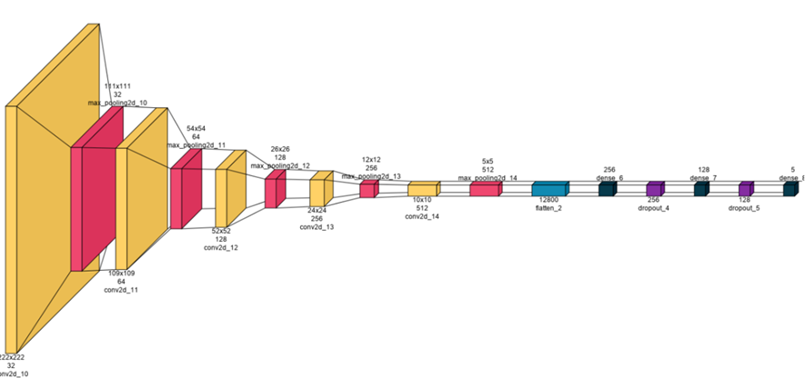

**Figure 1.** Basic CNN model.

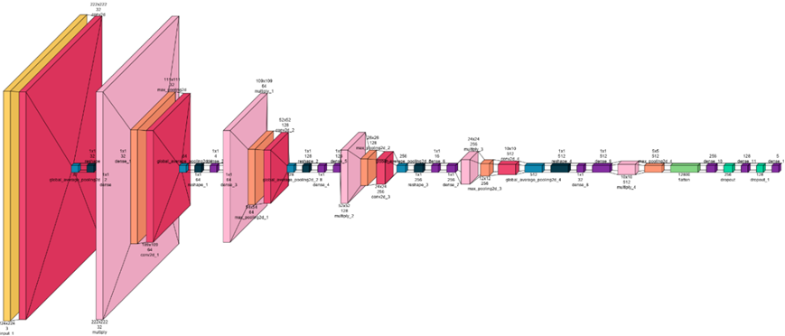

**Figure 2.** CNN-SE model.

The CNN-SE model shown in Figure 2 includes five convolutional layers, each strengthened with SE blocks and max-pooling layers. After flattening, two fully connected layers and dropout layers are added. This model used 4,922,821 trainable parameters.

Finally, to optimize the CNN-SE performance, we used local and global features as shown in Figure 3. This allows the model to consider both local and global details, leading to more accurate predictions.

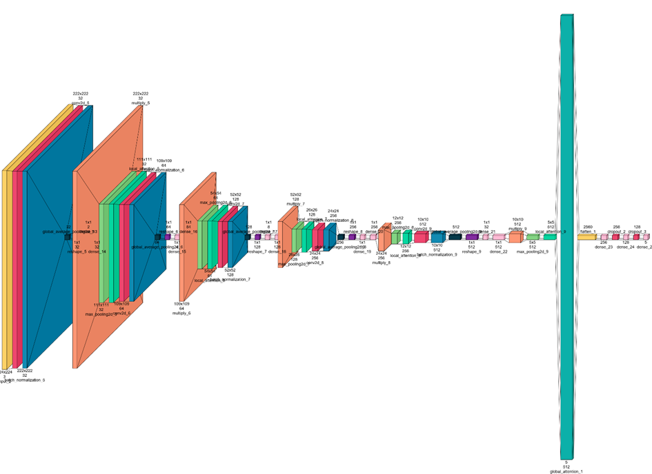

**Figure 3.** Proposed SE-LGANet model.

In transitioning from the CNN-SE model to the SE-LGANet model, several changes were made, including adding batch normalization and local attention blocks to each convolutional layer and utilizing a global attention layer at the end of the model. SE-LGANet integrates both local and global attention mechanisms, enhancing the feature extraction ability of the model. This model is robust and has more generalized feature learning capabilities. In this model, the number of trainable parameters has been reduced to 2,916,197.

### 2.6. Performance metrics and model evaluation

To evaluate each experimental trial, confusion matrices are constructed, and conventional performance indicators are computed [39], as detailed in Table 2. Furthermore, the model’s diagnostic efficacy is validated using the Area Under the Receiver Operating Characteristic Curve (ROC-AUC) metric. In these calculations, FP, FN, TP and TN represent False Positives, and False Negatives, True Positives and True Negatives, respectively.

**Table 2.** Summary of performance metrics used to evaluate the model from the confusion matrix.

| Metrics | Definition | Description |
| --- | --- | --- |
| Accuracy (Acc) | $(TN+TP)/(TN+TP+FP+FN)$ | Accuracy signifies the percentage of successful classifications across the entire set of analyzed observations. |
| Sensitivity (Se), Recall | $(TP)/(FN+TP)$ | Sensitivity denotes the model's ability to accurately detect positive instances relative to the complete set of ground-truth positive samples. |
| Specificity (Sp) | $(TN)/(FP+TN)$ | Specificity signifies the model's proficiency in identifying true negative samples relative to the entire set of ground-truth negative observations. |
| Precision | $(TP)/(FP+TP)$ | Precision quantifies the reliability of positive classifications by measuring the fraction of correct positive identifications relative to the overall volume of positive predictions. |
| F1-score | $2×(Recall×Precision)/(Recall+Precision)$ | A statistical measure that balances two metrics. |

## 3. Results

The computational experiments were conducted within a high-performance environment, leveraging an Intel® Xeon® Gold 6132 CPU and 128 GB of RAM, complemented by an NVIDIA P6000 GPU to facilitate rapid data processing and robust execution. Table 3 summarizes the hyperparameter values used to develop the three models: CNN, CNN-SE, and SE-LGANet.

**Table 3.** Hyperparameter settings used for the CNN, CNN-SE, and SE-LGANet models.

| Hyperparameter | CNN | CNN-SE | SE-LGANet |
| --- | --- | --- | --- |
| Input Size | 224x224 | 224x224 | 224x224 |
| Batch Size | 16 | 16 | 16 |
| Number of Epochs | 128 | 128 | 128 |
| Learning Rate | 0.001 | 0.001 | 0.001 |
| Number of Convolutional Layers | 5 | 5 | 5 |
| Number of Filters (Layer_1) | 32 | 32 | 32 |
| Number of Filters (Layer_2) | 64 | 64 | 64 |
| Number of Filters (Layer_3) | 128 | 128 | 128 |
| Number of Filters (Layer_4) | 256 | 256 | 256 |
| Number of Filters (Layer_5) | 512 | 512 | 512 |
| Squeeze-Excite Blocks | No | Yes | Yes |
| Batch Normalization | No | No | Yes |
| Local Attention Blocks | No | No | Yes |
| Global Attention Blocks | No | No | Yes |
| Fully Connected Layer_1 | 256 | 256 | 256 |
| Dropout Rate (Layer_1) | 0.5 | 0.5 | 0.5 |
| Fully Connected Layer_2 | 128 | 128 | 128 |
| Dropout Rate (Layer_2) | 0.5 | 0.5 | 0.5 |
| Total Number of Parameters | 4,879,173 | 4,922,821 | 2,916,197 |

Early Stopping was used during the training of all models, allowing termination before reaching the maximum number of epochs. This approach ensured optimal model performance by preventing overfitting and saving computational resources, allowing the models to achieve higher validation performance, and improved generalization and robustness using different datasets.

| 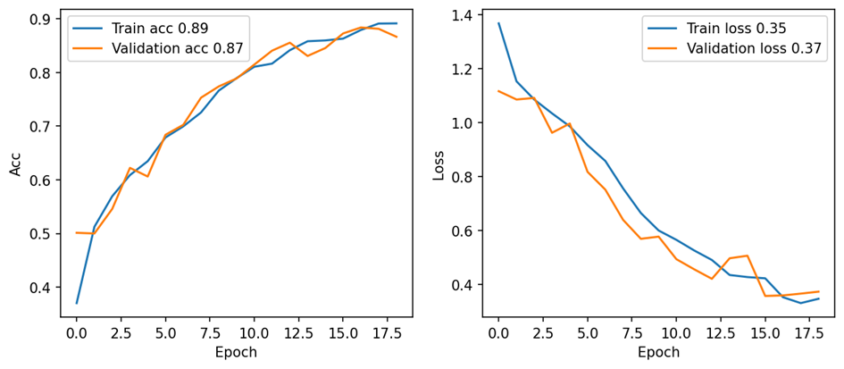 |
| --- |
| (a) |
| 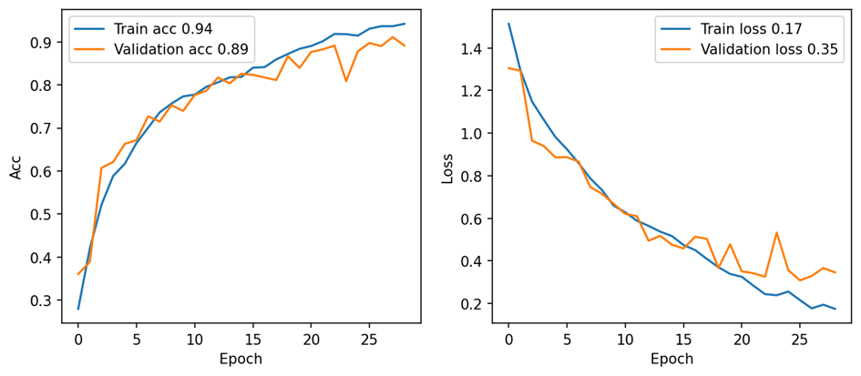 |
| (b) |
| 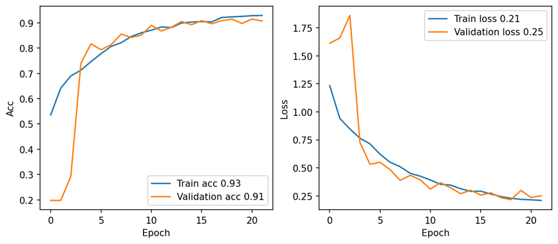 |
| (c) |

**Figure 4.** Accuracy and loss curves obtained for various models: (a) CNN; (b) CNN-SE; (c) SE-LGANet.

Figure 4 shows the accuracy and loss curves observed on various models during training and validation. Upon examining the accuracy and loss curves of the CNN, CNN-SE, and SE-LGANet models, it may be noted that training and validation accuracies increased while losses decreased for each model. The CNN model demonstrated reasonable performance with 89% training accuracy, and 87% validation accuracy. The CNN-SE model achieved higher training accuracy of 94% and validation accuracy of 89% due to SE blocks. The SE-LGANet model exhibited the best performance, attaining 93% training accuracy and 91% validation accuracy. This model showed significant improvement in accuracy and overall performance due to the incorporation of both local and global attention mechanisms.

|  |
| --- |
| (a) |
| 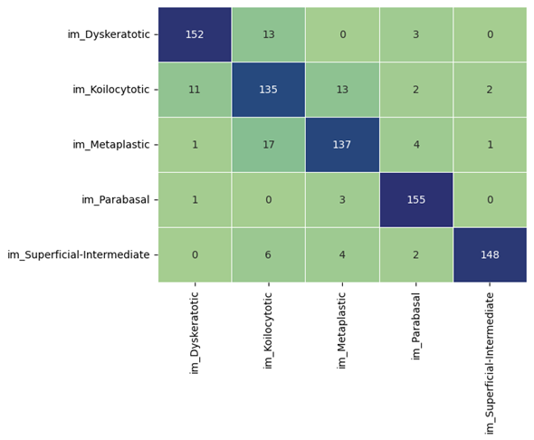 |
| (b) |
| 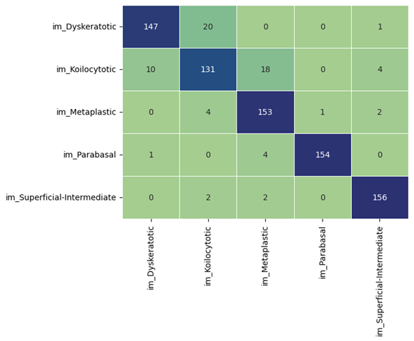 |
| (c) |

**Figure 5.** Confusion matrices obtained using various models: (a) CNN; (b) CNN-SE; (c) SE-LGANet.

The confusion matrices obtained are presented in Figure 5. It can be seen from Figure 5 that the SE-LGANet model exhibited the best performance with the minimum class confusion. This model performed better in classifying the Metaplastic, Parabasal and Superficial-Intermediate classes. These results demonstrate that attention mechanisms significantly enhanced the performance of the model.

Table 4 compares the performance metrics obtained using CNN, CNN-SE, and SE-LGANet models.

**Table 4.** Summary of performances obtained using CNN, CNN-SE and SE-LGANet models.

| Metrics | CNN | CNN-SE | SE-LGANet |
| --- | --- | --- | --- |
| Accuracy | 0.8728 | 0.8975 | 0.9148 |
| Error | 0.1272 | 0.1025 | 0.0852 |
| Sensitivity | 0.8731 | 0.8978 | 0.9157 |
| Specificity | 0.9682 | 0.9744 | 0.9787 |
| Precision | 0.8746 | 0.8994 | 0.9160 |
| False Positive Rate | 0.0318 | 0.0256 | 0.0213 |
| F1 Score | 0.8725 | 0.8983 | 0.9151 |

The CNN model exhibited baseline performance with 87.28% accuracy and a 12.72% error rate. The CNN-SE model improved accuracy to 89.75% and reduced the error rate to 10.25% with the addition of SE blocks. The SE-LGANet model showed the highest performance, increasing accuracy to 91.48% and decreased the error rate to 8.52%. The sensitivity of the CNN model is 87.31%, which increased to 89.78% in the CNN-SE model and 91.57% in the SE-LGANet model. Specificity values increased sequentially from 96.82% to 97.44% and 97.87%. Precision and F1 scores reach their highest values in the SE-LGANet model at 91.60% and 91.51%, respectively. The false positive rate decreased from 3.18% in the CNN model to 2.56% in the CNN-SE model and 2.13% in the SE-LGANet model. The CNN-SE and SE-LGANet models offered higher performance and accuracy compared to the baseline CNN model, reducing false positive rates and enhancing overall classification success. These improvements highlighted the significant contribution of attention mechanisms to model performance.

| 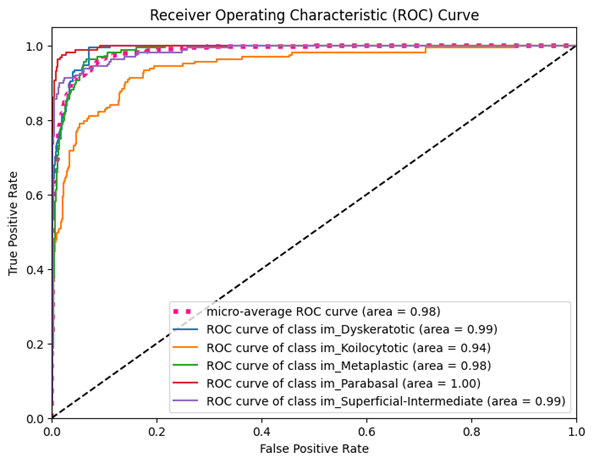 |
| --- |
| (a) |
| 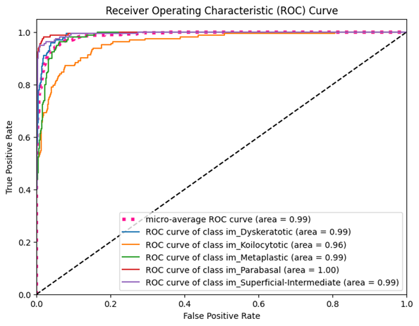 |
| (b) |
| 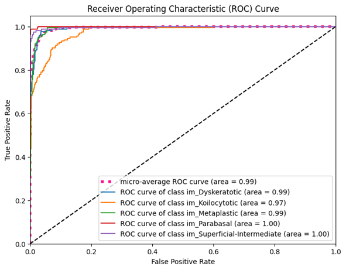 |
| (c) |

**Figure 6.** ROC curves obtained for various models: (a) CNN; (b) CNN-SE; (c) SE-LGANet.

Figure 6 shows the ROC curves obtained using various models. The ROC curves for the CNN, CNN-SE, and SE-LGANet models by class, demonstrate their validation performance. The CNN model’s micro-average ROC curve is 0.98, with the Parabasal class standing out with the highest AUC value 1.00. For the CNN-SE model, the micro-average ROC curve is 0.99, with high AUC values across all classes. Notably, the Koilocytotic class shows an improvement, with its AUC value increasing from 0.94 to 0.96. The SE-LGANet model also has a micro-average ROC curve of 0.99, achieved the highest performance across all classes. In this model, the AUC values for the Koilocytotic and Parabasal classes are recorded as 0.97 and 1.00, respectively. Overall, the CNN-SE and SE-LGANet models showed significant improvements in validation performance with steeper ROC curves and higher AUC values. These findings indicate that attention mechanisms and SE blocks are effective in enhancing model accuracy and discriminative power.

Visualizing intermediate layer features from images facilitates understanding of the internal working mechanisms of the model and allows visualization of which features are extracted. In this process, the dataset is first loaded and the images are scaled and fed to the trained model. The features are extracted from a specific intermediate layer. An example from the validation dataset is taken, and intermediate layer features are extracted from this example. The dimensions of the intermediate layer features are printed, and the first 64 channels of these features are visualized in an 8x8 grid. This step is crucial for analyzing how specific layers of the model process the input and what patterns or features they learn.

| 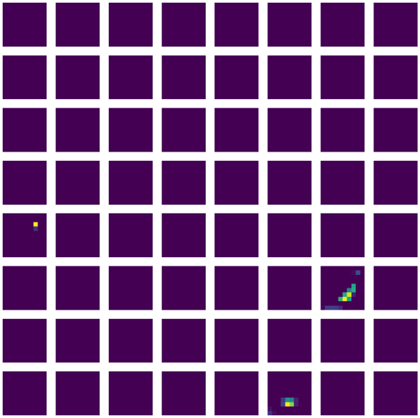 |
| --- |
| (a) |
| 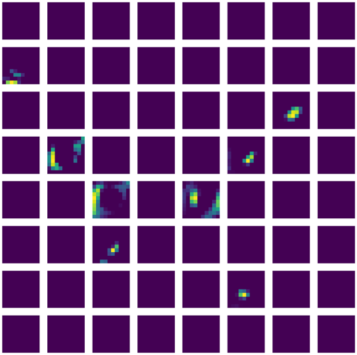 |
| (b) |
| 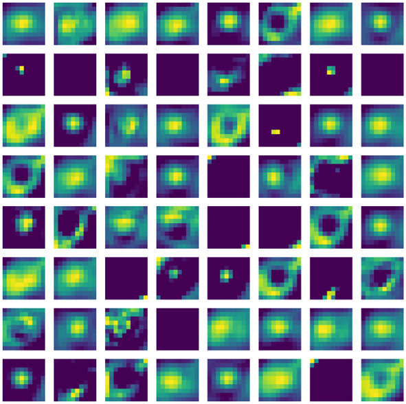 |
| (c) |

**Figure 7.** Intermediate layer visualizations of: (a) CNN; (b) CNN-SE; (c) SE-LGANet.

Figure 8 illustrates the visual explanations obtained for the three proposed models via Grad-CAM. The results for the base CNN model indicate that the focus areas are indistinct and widespread. In contrast, the CNN-SE model shows concentration on more specific regions with clearer boundaries. The SE-LGANet model, which integrates both local and global attention mechanisms, yields even sharper and more localized focus points during the decision-making process. These findings suggest that incorporating attention mechanisms enables the model to better identify critical regions, thereby enhancing both diagnostic accuracy and interpretability compared to standard CNN.

| 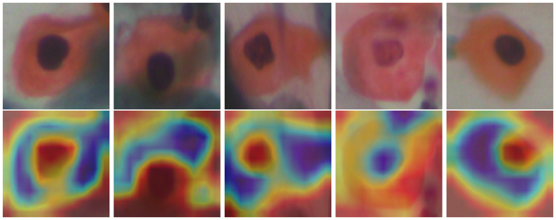 |
| --- |
| (a) |
| 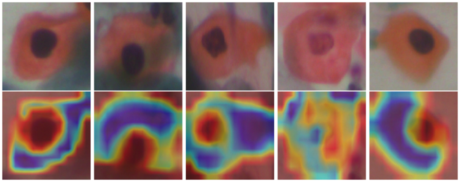 |
| (b) |
| 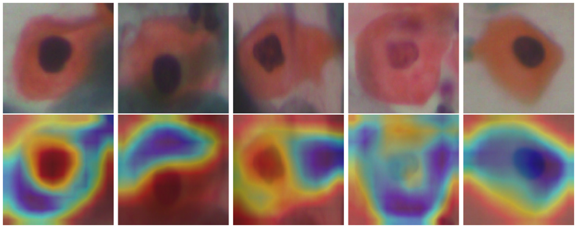 |
| (c) |

**Figure 8.** Grad-CAM results obtained using proposed models: (a) CNN; (b) CNN-SE; (c) SE-LGANet.

To validate the robustness of the proposed model, it has been tested on other commonly used publicly available datasets, i.e., the Mendeley LBC and Herlev datasets. To validate the SE-LGANet model, the hold-out approach was utilized with an 8:2 train-test split ratio as in previous experiments. The confusion matrix is given in Figure 9 (a). The SE-LGANet model demonstrated remarkable performance on the Mendeley LBC dataset, achieving an accuracy of 96.88% and a low error rate of 3.12%. High sensitivity (91.70%), and specificity (99.12%) indicate excellent diagnostic capability. The precision of 91.88%, and a low false positive rate (0.88%) underscore the model’s reliability. The F1 score (91.74%) and Matthews Correlation Coefficient (90.78%) further validate the model’s robustness and balanced performance across different classes. The Grad-CAM results in Figure 9 (b) showcase the model’s ability to highlight critical regions within the cervical cell images that influence its predictions. The activation maps (bottom row) indicate that the model effectively focuses on relevant cellular structures, providing visual explanations for its decisions and enhancing the interpretability and trustworthiness of the AI-driven classification.

| 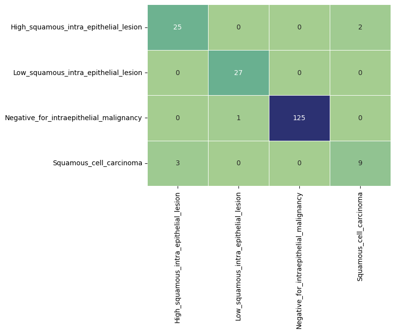 |
| --- |
| (a) |
| 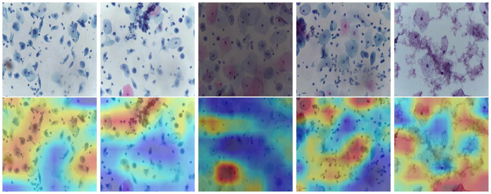 |
| (b) |

**Figure 9.** SE-LGANet model evaluation for Mendeley LBC dataset: (a) confusion matrix; (b) Grad-CAM results.

As for the Herlev dataset, it was split into 734 training samples and 183 test samples for binary classification. The corresponding confusion matrix is presented in Figure 10 (a). The SE-LGANet model's performance on the Herlev dataset shows a high accuracy of 89.62%. It demonstrates excellent sensitivity (93.43%) and precision (92.75%), indicating reliable detection of positive cases. The Grad-CAM results for the Herlev dataset are shown in Figure 10 (b). These findings reveal that the model effectively identifies and highlights critical regions within the cervical cell images. The activation maps (bottom row) show focused attention on key areas such as the nucleus and cytoplasmic features, indicating that the model's predictions are based on relevant and significant cellular structures. This enhances the model's interpretability and supports its diagnostic accuracy.

| 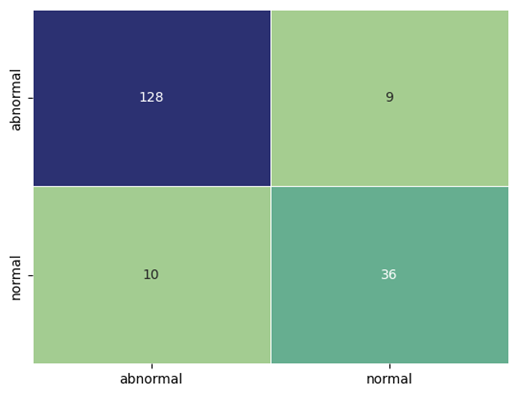 |
| --- |
| (a) |
| 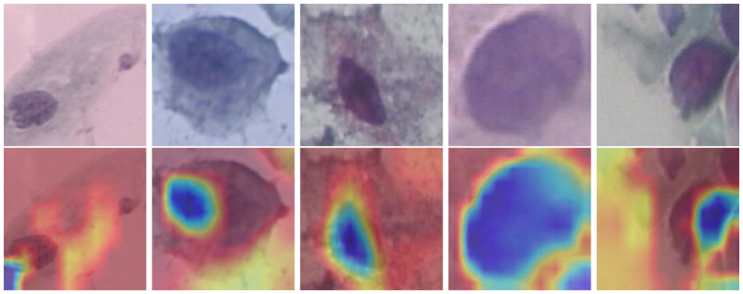 |
| (b) |

**Figure 10.** SE-LGANet model evaluation for Herlev dataset: (a) confusion matrix; (b) Grad-CAM results.

## 4. Discussion

The proposed model is distinguished by its innovative integration of SE blocks and dual (local/global) attention mechanisms. Unlike traditional methods that rely solely on standard machine learning algorithms or pretrained CNNs without auxiliary feature enhancement layers, this architecture optimizes channel interdependencies to amplify salient features while suppressing irrelevant noise. Furthermore, the localized and global attention layers enable the model to prioritize critical regions within the input data, thereby refining the understanding of complex pathological contexts. These innovations collectively improve accuracy and robustness in feature extraction, as evidenced by the comparative results. A comprehensive summary of the performance of the developed model against existing literature, evaluated across various public datasets, is presented in Table 5.

**Table 5.** Comparative summary of automated cervical cancer classification performance using public datasets.

| Reference | Methods | Model Type | Dataset | Sample | Model Validation | Accuracy (%) |
| --- | --- | --- | --- | --- | --- | --- |
| [23] | Hybrid deep learning using pretrained models and fuzzy min-max neural network | Hybrid | Herlev | 917 | Hold out N/A ratio | 88.60 |
|  |  |  | SIPaKMeD | 4049 |  | 95.14 |
| [11] | Hybrid segmentation and extra trees classifier | ML | Herlev | 917 | 10-fold CV | 100 |
| [40] | CNN and ViT models with max-voting technique | DL | SIPaKMeD | 4049 | Hold out 75:25 ratio | 92.95 |
| [17] | AlexNet with ROI extraction and preprocessing | DL | Herlev | 917 | Hold out 70:15:15 ratio | 95.78 |
| [12] | Two-stage architecture with SMOTE and Machine Learning Models | ML | UC Irvine ML Repository | 858 | 10-fold CV | 99.00 |
| [19] | CerCanNet with transfer learning from three CNNs | DL | SIPaKMeD | 4049 | 5-fold CV | 97.70 |
|  |  |  | Mendeley LBC | 963 |  | 100.00 |
| [20] | DL with colposcopy images | DL | Intel & MobileODT / IARC | 6734/913 | Hold out N/A ratio | 99.00 |
| [21] | DenseNet-201, pre-trained models | DL | Herlev | 917 | Hold out 80:20 ratio | 87.02 |
| [25] | ELM-based classifier with CNN and AE | Hybrid | Herlev | 917 | 5-fold | 99.70 (2-class) |
|  |  |  |  |  |  | 97.20 (7-class)) |
| This Study | CNN, SE, Local and Global Attention | DL | Mendeley LBC | 963 | Hold out 80:20 ratio | 96.88 |
|  |  |  | Herlev | 917 |  | 89.62 |
|  |  |  | SIPaKMeD | 4049 |  | 91.48 |

To validate its efficacy, the proposed model’s performance was benchmarked against several existing methods that utilize the same publicly available datasets. We critically evaluate factors contributing to performance discrepancies, including methodology, dataset usage, and augmentation techniques. Additionally, we emphasize the importance of XAI, showcasing how Grad-CAM enhances model interpretability and clinical trustworthiness. We have also validated our model using all public databases highlighting the robustness of the model. Table 5 summarizes related works by outlining their proposed methods, model types, datasets used, and reported accuracy metrics. The disparity in results may be attributed to various factors, including differences in the proposed methodologies, dataset utilization, data splitting, augmentation techniques, and learning approaches. For instance, hybrid models combining deep learning with traditional machine learning classifiers often leverage the strengths of both paradigms, leading to improved performance [24,25]. Additionally, some studies employed extensive data augmentation and ensemble learning strategies, which can significantly enhance model robustness and accuracy. The choice of datasets also plays a crucial role, as variations in dataset size, class distribution, and quality can impact the generalizability of the models. Furthermore, differences in data splitting methods, such as cross-validation versus simple train-test splits, can lead to varying performance outcomes. These factors collectively influence the reported performance and highlight the complexity of achieving optimal performance in cervical cell classification tasks.

The proposed model achieved an accuracy of 91.48% on the SIPaKMeD dataset, while other studies reported higher accuracies, such as 95.33% [23] and 99.23% [15]. However, when tested on additional datasets, the SE-LGANet model demonstrated superior performance, achieving 96.88% accuracy on the Mendeley LBC dataset and 89.62% accuracy on the Herlev dataset. These results, coupled with high sensitivity and specificity across both datasets, underscore the model's robustness and generalizability in classifying cervical cell images from diverse sources. Despite slight variations in performance across datasets, the model consistently provided reliable and interpretable predictions, as evidenced by the Grad-CAM visualizations, which effectively highlighted the critical regions within the images that influenced the model’s decisions.

Many related studies lack XAI components, limiting their transparency in clinical decision-making. The proposed method addresses this gap by incorporating Grad-CAM, which provides visual explanations of the model’s decisions. By generating heat maps, Grad-CAM highlights the regions of lesions in the input images that significantly influence the model’s predictions. This not only enhances the interpretability of the results but also builds trust among healthcare professionals by making the AI’s decision process more transparent.

A primary constraint of the current study involves the heavy dependency on extensive, high-fidelity data corpora for effective model optimization. Additionally, although Grad-CAM improves transparency, deciphering the resulting visual heatmaps necessitates a profound level of clinical specialization. Furthermore, the integration of multiple advanced techniques could complicate the model’s deployment and maintenance in clinical settings, requiring specialized knowledge for effective implementation and troubleshooting.

## 5. Conclusions

Cervical cancer remains a critical global health challenge, characterized by high mortality rates among women. In this study, we introduced a novel deep learning architecture designed to classify five distinct cervical cell categories using Pap smear imagery. By integrating SE blocks with a dual local-global attention mechanism, the model’s feature extraction capabilities were significantly enhanced, prioritizing salient descriptors while mitigating noise from irrelevant regions. Evaluated on the SIPaKMeD dataset, the proposed framework demonstrated superior performance, achieving an accuracy of 91.48%, a sensitivity of 91.57%, and a specificity of 97.87%. To bridge the gap between AI and clinical practice, Grad-CAM was implemented as an XAI tool to visualize and localize lesion areas, thereby enhancing clinical interpretability and trust. Although current validation is limited to three publicly available datasets, future research will focus on evaluating the model's robustness across extensive and diverse multi-center cohorts involving various ethnic demographics.

Author Contributions: Conceptualization, O.F.A., Z.C., M.A. and Y.Y.; methodology, O.F.A., Z.C., M.A.; software, O.F.A., Z.C., ; validation, O.F.A., M.A. and Z.Z.; formal analysis, X.X.; investigation, X.X.; resources, X.X.; data curation, X.X.; writing—original draft preparation, O.F.A., Z.C., M.A.; writing—review and editing, X.X.; visualization, , O.F.A., Z.C., M.A. All authors have read and agreed to the published version of the manuscript.

Funding: Please add: “This research received no external funding” or “This research was funded by NAME OF FUNDER, grant number XXX” and “The APC was funded by XXX”. Check carefully that the details given are accurate and use the standard spelling of funding agency names at https://search.crossref.org/funding. Any errors may affect your future funding.

Institutional Review Board Statement: In this section, please add the Institutional Review Board Statement and approval number for studies involving humans or animals. You might choose to exclude this statement if the study did not require ethical approval. Please note that the Editorial Office might ask you for further information. Please add “The study was conducted in accordance with the Declaration of Helsinki and approved by the Institutional Review Board (or Ethics Committee) of NAME OF INSTITUTE (protocol code XXX and date of approval).” for studies involving humans. OR “The animal study protocol was approved by the Institutional Review Board (or Ethics Committee) of NAME OF INSTITUTE (protocol code XXX and date of approval).” for studies involving animals. OR “Ethical review and approval were waived for this study due to REASON (please provide a detailed justification).” OR “Not applicable” for studies not involving humans or animals.

Informed Consent Statement: Any research article describing a study involving humans should contain this statement. Please add “Informed consent was obtained from all subjects involved in the study.” OR “Patient consent was waived due to REASON (please provide a detailed justification).” OR “Not applicable.” for studies not involving humans. You might also choose to exclude this statement if the study did not involve humans.

Written informed consent for publication must be obtained from participating patients who can be identified (including by the patients themselves). Please state “Written informed consent has been obtained from the patient(s) to publish this paper” if applicable.

Data Availability Statement: A publicly available dataset was used.

Acknowledgments: In this section, you can acknowledge any support given which is not covered by the author contribution or funding sections. This may include administrative and technical support, or donations in kind (e.g., materials used for experiments). Where GenAI has been used for purposes such as generating text, data, or graphics, or for study design, data collection, analysis, or interpretation of data, please add “During the preparation of this manuscript/study, the author(s) used [tool name, version information] for the purposes of [description of use]. The authors have reviewed and edited the output and take full responsibility for the content of this publication.”

Conflicts of Interest: The authors declare no conflicts of interest.” Authors must identify and declare any personal circumstances or interest that may be perceived as inappropriately influencing the representation or interpretation of reported research results. Any role of the funders in the design of the study; in the collection, analyses or interpretation of data; in the writing of the manuscript; or in the decision to publish the results must be declared in this section. If there is no role, please state “The funders had no role in the design of the study; in the collection, analyses, or interpretation of data; in the writing of the manuscript; or in the decision to publish the results”.

## Abbreviations

The following abbreviations are used in this manuscript:

| ML | Machine Learning |
| --- | --- |
| DL | Deep Learning |
| VC | Cros-Validation |
|  |  |

## References

Molina MA, Steenbergen RDM, Pumpe A, Kenyon AN, Melchers WJG. HPV integration and cervical cancer: a failed evolutionary viral trait. Trends Mol Med 2024. https://doi.org/https://doi.org/10.1016/j.molmed.2024.05.009.

Huy NVQ, Tam LM, Tram NVQ, Thuan DC, Vinh TQ, Thanh CN, et al. The value of visual inspection with acetic acid and Pap smear in cervical cancer screening program in low resource settings – A population-based study. Gynecol Oncol Reports 2018;24:18–20. https://doi.org/https://doi.org/10.1016/j.gore.2018.02.004.

William W, Ware A, Basaza-Ejiri AH, Obungoloch J. A review of image analysis and machine learning techniques for automated cervical cancer screening from pap-smear images. Comput Methods Programs Biomed 2018;164:15–22. https://doi.org/https://doi.org/10.1016/j.cmpb.2018.05.034.

Bond S. Conventional Glass Slide Pap Smears are as Accurate as Liquid-Based Tests in Detecting Cervical Disease. J Midwifery Womens Health 2008;53:395–6. https://doi.org/https://doi.org/10.1016/j.jmwh.2008.04.012.

Ahmadzadeh Sarhangi H, Beigifard D, Farmani E, Bolhasani H. Deep learning techniques for cervical cancer diagnosis based on pathology and colposcopy images. Informatics Med Unlocked 2024;47:101503. https://doi.org/https://doi.org/10.1016/j.imu.2024.101503.

Sambyal D, Sarwar A. Recent developments in cervical cancer diagnosis using deep learning on whole slide images: An Overview of models, techniques, challenges and future directions. Micron 2023;173:103520. https://doi.org/10.1016/j.micron.2023.103520.

Ferrara P, Dallagiacoma G, Alberti F, Gentile L, Bertuccio P, Odone A. Prevention, diagnosis and treatment of cervical cancer: A systematic review of the impact of COVID-19 on patient care. Prev Med (Baltim) 2022;164:107264. https://doi.org/https://doi.org/10.1016/j.ypmed.2022.107264.

Zafar A, Alruwaili NK, Imam SS, Alharbi KS, Afzal M, Alotaibi NH, et al. Novel nanotechnology approaches for diagnosis and therapy of breast, ovarian and cervical cancer in female: A review. J Drug Deliv Sci Technol 2021;61:102198. https://doi.org/https://doi.org/10.1016/j.jddst.2020.102198.

Shen S, Zhang S, Liu P, Wang J, Du H. Potential role of microRNAs in the treatment and diagnosis of cervical cancer. Cancer Genet 2020;248–249:25–30. https://doi.org/https://doi.org/10.1016/j.cancergen.2020.09.003.

Dasari S, Wudayagiri R, Valluru L. Cervical cancer: Biomarkers for diagnosis and treatment. Clin Chim Acta 2015;445:7–11. https://doi.org/https://doi.org/10.1016/j.cca.2015.03.005.

[Singh SK, Goyal A. Performance Analysis of Machine Learning Algorithms for Cervical Cancer Detection. Res Anthol Med Informatics Breast Cerv Cancer 2023:347–70. https://doi.org/10.4018/978-1-6684-7136-4.ch019.

Kılıçarslan S, Gögebakan M, Közkurt C. Cervical Cancer Prediction Using SMOTE Algorithm and Machine Learning Approaches 2023;13:747–59. https://doi.org/10.21597/jist.1222764.

Ali MS, Hossain MM, Kona MA, Nowrin KR, Islam MK. An ensemble classification approach for cervical cancer prediction using behavioral risk factors. Healthc Anal 2024;5:100324. https://doi.org/10.1016/j.health.2024.100324.

Pacal I, Kılıçarslan S. Deep learning-based approaches for robust classification of cervical cancer Deep learning-based approaches for robust classification of cervical cancer. Neural Comput Applic 2023. https://doi.org/10.1007/s00521-023-08757-w.

Shervan F-E, Marwa Fadhil A, Fekri-Ershad S, Alsaffar MF. Developing a Tuned Three-Layer Perceptron Fed with Trained Deep Convolutional Neural Networks for Cervical Cancer Diagnosis. Diagnostics 2023;13:686. https://doi.org/10.3390/diagnostics13040686.

Kumari CM, Bhavani R, Padmashree S, Priya R. Identifıcation And Classification Of Cervical Cancer Using Convolutional Neural Network Based On Fisher Score. J Data Acquis Process 2023;38:2118–32. https://doi.org/10.5281/zenodo.776883.

Shiny TL, Parasuraman K. ROI Extraction and Nuclei Classification of Pap Smear Images for Cervical Cancer Detection. 2023 2nd Int Conf Vis Towar Emerg Trends Commun Netw Technol 2023:1–7. https://doi.org/10.1109/ViTECoN58111.2023.10157033.

Kurita Y, Meguro S, Tsuyama N, Kosugi I, Enomoto Y, Kawasaki H, et al. Automated Algorithm Development And Analysis Of Pap Smear Images To Diagnose Cervical Cancer A Thesis. PLoS One 2023:1–17. https://doi.org/10.1371/journal.pone.0285996.

Attallah O. CerCan · Net : Cervical cancer classification model via multi-layer feature ensembles of lightweight CNNs and transfer learning. Expert Syst Appl 2023;229:120624. https://doi.org/10.1016/j.eswa.2023.120624.

Youneszade N, Marjani M, Ray SK. A Predictive Model to Detect Cervical Diseases Using Convolutional Neural Network Algorithms and Digital Colposcopy Images. IEEE Access 2023;11:59882–98. https://doi.org/10.1109/ACCESS.2023.3285409.

Tan SL, Selvachandran G, Ding W, Paramesran R, Kotecha K. Cervical Cancer Classification From Pap Smear Images Using Deep Convolutional Neural Network Models. Interdiscip Sci Comput Life Sci 2023. https://doi.org/10.1007/s12539-023-00589-5.

Dayalane S, Murugesan S, Mathivanan SK, Rajadurai H, Panneer Selvam K, Shah MA. Cervical Cancer Classification Using Deep Learning Approach Using Colposcopy Images. Neural Process Lett 2025;57:65. https://doi.org/10.1007/s11063-025-11770-w.

Kalbhor M, Shinde S, Popescu DE, Hemanth DJ. Hybridization of Deep Learning Pre-Trained Models with Machine Learning Classifiers and Fuzzy Min–Max Neural Network for Cervical Cancer Diagnosis. Diagnostics 2023;13:1363. https://doi.org/10.3390/diagnostics13071363.

Hamdi M, Senan EM, Awaji B, Olayah F, Jadhav ME, Alalayah KM. Analysis of WSI Images by Hybrid Systems with Fusion Features for Early Diagnosis of Cervical Cancer. Diagnostics 2023;13. https://doi.org/10.3390/diagnostics13152538.

Ghoneim A, Muhammad G, Hossain MS. Cervical cancer classification using convolutional neural networks and extreme learning machines. Futur Gener Comput Syst 2020;102:643–9. https://doi.org/10.1016/j.future.2019.09.015.

Mahajan P, Kaur P, Singh K, Cheema AK. Comparative analysis for classification of cervical cancer cells using binary red deer algorithm and ResNet framework. Biomed Signal Process Control 2026;113:109107. https://doi.org/10.1016/j.bspc.2025.109107.

Plissiti ME, Dimitrakopoulos P, Sfikas G, Nikou C, Krikoni O, Charchanti A. Sipakmed: A New Dataset for Feature and Image Based Classification of Normal and Pathological Cervical Cells in Pap Smear Images. 2018 25th IEEE Int. Conf. Image Process., 2018, p. 3144–8. https://doi.org/10.1109/ICIP.2018.8451588.

Hussain E, Mahanta LB, Borah H, Das CR. Liquid based-cytology Pap smear dataset for automated multi-class diagnosis of pre-cancerous and cervical cancer lesions. Data Br 2020;30:105589. https://doi.org/https://doi.org/10.1016/j.dib.2020.105589.

Jantzen J, Norup J, Dounias G, Bjerregaard B. Pap-smear Benchmark Data For Pattern Classification. Proc. NiSIS 2005, NiSIS; 2005, p. 1–9.

Mäenpää SM, Korja M. Diagnostic test accuracy of externally validated convolutional neural network (CNN) artificial intelligence (AI) models for emergency head CT scans – A systematic review. Int J Med Inform 2024:105523. https://doi.org/https://doi.org/10.1016/j.ijmedinf.2024.105523.

Wu R, Qin K, Fang Y, Xu Y, Zhang H, Li W, et al. Application of the convolution neural network in determining the depth of invasion of gastrointestinal cancer: a systematic review and meta-analysis. J Gastrointest Surg 2024;28:538–47. https://doi.org/https://doi.org/10.1016/j.gassur.2023.12.029.

Demir F, Abdullah DA, Sengur A. A New Deep CNN Model for Environmental Sound Classification. IEEE Access 2020;8:66529–37. https://doi.org/10.1109/ACCESS.2020.2984903.

Wang Y, Xie W, Liu C, Luo J, Qiu Z, Deconinck G. Forecast of coal consumption in salt lake enterprises based on temporal gated recurrent unit network with squeeze-and-excitation attention. Energy 2024;299:131405. https://doi.org/https://doi.org/10.1016/j.energy.2024.131405.

Joshy AA, Rajan R. Dysarthria severity assessment using squeeze-and-excitation networks. Biomed Signal Process Control 2023;82:104606. https://doi.org/https://doi.org/10.1016/j.bspc.2023.104606.

Tyagi S, Talbar SN. LCSCNet: A multi-level approach for lung cancer stage classification using 3D dense convolutional neural networks with concurrent squeeze-and-excitation module. Biomed Signal Process Control 2023;80:104391. https://doi.org/https://doi.org/10.1016/j.bspc.2022.104391.

Tan Z, Madzin H, Norafida B, Rahmat RWOK, Khalid F, Sulaiman PS. SwinUNeLCsT: Global–local spatial representation learning with hybrid CNN–transformer for efficient tuberculosis lung cavity weakly supervised semantic segmentation. J King Saud Univ - Comput Inf Sci 2024;36:102012. https://doi.org/https://doi.org/10.1016/j.jksuci.2024.102012.

He Y, Wu B, Liu X, Wang B, Fu J, Hu S. AEGLR-Net: Attention enhanced global–local refined network for accurate detection of car body surface defects. Robot Comput Integr Manuf 2024;90:102806. https://doi.org/https://doi.org/10.1016/j.rcim.2024.102806.

Wu J, Shi Y, Yan S, Yan H. Global-Local combined features to detect pain intensity from facial expression images with attention mechanism1. J Electron Sci Technol 2024:100260. https://doi.org/https://doi.org/10.1016/j.jnlest.2024.100260.

Cömert Z, Kocamaz AF, Subha V. Prognostic model based on image-based time-frequency features and genetic algorithm for fetal hypoxia assessment. Comput Biol Med 2018. https://doi.org/10.1016/j.compbiomed.2018.06.003.

Pacal I, Kılıcarslan S. Deep learning-based approaches for robust classification of cervical cancer. Neural Comput Appl 2023;35:18813–28. https://doi.org/10.1007/s00521-023-08757-w.

Disclaimer/Publisher’s Note: The statements, opinions and data contained in all publications are solely those of the individual author(s) and contributor(s) and not of MDPI and/or the editor(s). MDPI and/or the editor(s) disclaim responsibility for any injury to people or property resulting from any ideas, methods, instructions or products referred to in the content.
